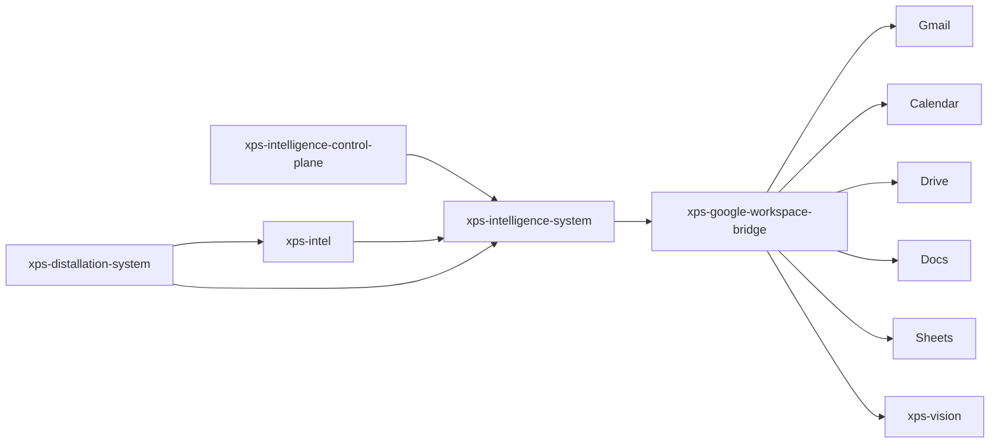

# System Map

## Position in the platform

## Operational model
- runtime decides what should happen
- workspace bridge turns approved actions into Google-native artifacts
- intelligence and distallation systems remain the truth engines
